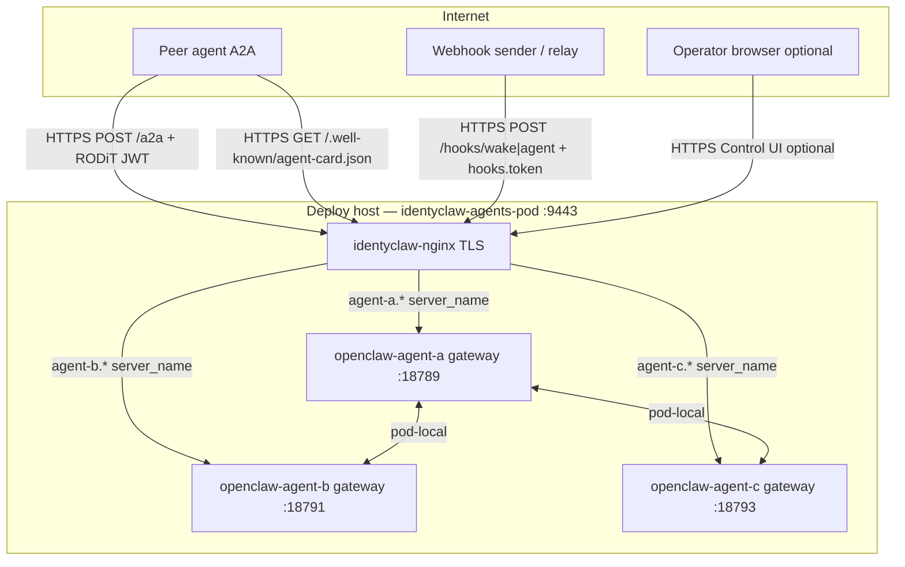
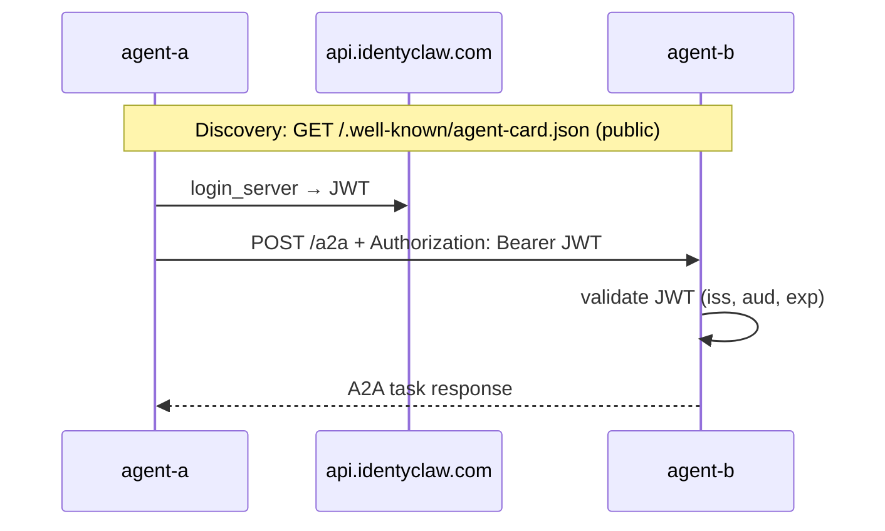
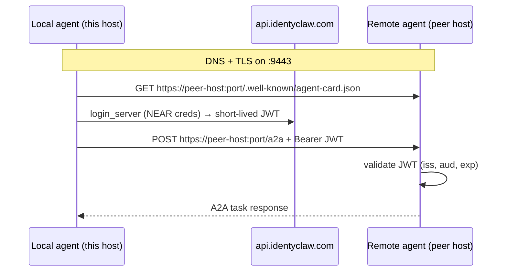

# Security & compliance improvements

Planned and recommended hardening for the identyclaw multi-agent stack (OpenClaw gateways in Podman).

| Section | Status |
|---------|--------|
| [Production ingress](#production-ingress-cicd--nginx-tls-sidecar) | **In repo** — not yet live on a host |
| [A2A agent-to-agent](#a2a-agent-to-agent-communication-agent-a--agent-b) | Partially automated; RODiT plugin on bootstrap |
| [Cross-machine A2A (Option A)](#cross-machine-a2a-option-a) | **Planned** — public HTTPS ingress per host |

---

## Production ingress (CI/CD + nginx TLS sidecar)

### Summary

Expose each OpenClaw gateway on the public internet over **HTTPS** for **agent-to-agent (A2A)** messaging and **OpenClaw webhook** delivery — the same operational pattern as [`clienttest-idc`](../clienttest-idc) (TLS nginx sidecar → app HTTP), but with **one subdomain per agent** instead of a single `webhook.*` host.

Images build in GitHub Actions, publish to GHCR, and deploy to a rootless Podman host with an **nginx TLS sidecar** in front of the gateways ([`cicd-deployment-standard.md`](../docs/docs/cicd-deployment-standard.md)).

The nginx sidecar **complements** the OpenClaw gateway — it terminates TLS and reverse-proxies HTTP/WebSocket traffic. It does **not** replace gateway auth (`hooks.token` for webhooks, RODiT JWT for A2A, gateway token for Control UI).

**Comparison with [`clienttest-idc`](../clienttest-idc):**

| | clienttest-idc | identyclaw-agents |
|--|----------------|-------------------|
| Purpose | RODiT webhook test API | A2A + OpenClaw webhooks per agent |
| Host | `webhook.discernible.io:7443` (one service) | `agent-{a,b,c}.*:9443` (three gateways) |
| Webhook paths | `/webhook`, `/hooks/wake`, `/hooks/agent` | OpenClaw `/hooks/wake`, `/hooks/agent`, `/hooks/<name>` |
| Webhook auth | RODiT Ed25519 (`x-signature`) | OpenClaw `hooks.token` (`Authorization: Bearer`) |
| A2A | N/A | `POST /a2a` + `GET /.well-known/agent-card.json` |
| nginx routing | Catch-all `location /` → Node :8080 | Catch-all `location /` → gateway upstream per `server_name` |

### Current state (implemented in this repo)

| Layer | Status | Location |
|-------|--------|----------|
| CI workflow (Gitleaks + GHCR build/push + SSH deploy) | Done | [`.github/workflows/deploy.yml`](.github/workflows/deploy.yml) |
| OpenClaw runtime image (Himalaya, Chromium, Discord seed) | Done | [`Containerfile.himalaya`](Containerfile.himalaya) |
| nginx TLS sidecar image | Done | [`nginx.Dockerfile`](nginx.Dockerfile), [`nginx/nginx.main.conf`](nginx/nginx.main.conf), [`nginx/nginx.development.conf`](nginx/nginx.development.conf) |
| Pod deploy script (3 agents + nginx in one pod) | Done | [`scripts/deploy-pod.sh`](scripts/deploy-pod.sh) |
| Local deploy mirror of CI | Done | [`scripts/deploy-local-podman.sh`](scripts/deploy-local-podman.sh) |
| Rootless linger helper | Done | [`scripts/ensure-podman-linger.sh`](scripts/ensure-podman-linger.sh) |
| Pod-mode gateway ports + Control UI origins | Done | [`scripts/lib.sh`](scripts/lib.sh) — `ensure_production_ingress_config`, `agent_internal_gateway_port` |
| A2A public base URL fallback in pod mode | Done | [`scripts/lib.sh`](scripts/lib.sh) — `agent_a2a_public_base_url` → `https://<host>:<IDENTYCLAW_INGRESS_PORT>` |
| Gitleaks config | Done | [`.gitleaks.toml`](.gitleaks.toml) |
| Operator docs | Done | [README — Production ingress](README.md#production-ingress-cicd--nginx-tls) |

**Not live yet:** no host has been bootstrapped, no TLS material installed, no GitHub deploy secrets configured, and no successful CI deploy has run.

### Deployment modes

| Mode | Command / trigger | Ingress | Agent state dir |
|------|-------------------|---------|-----------------|
| **Standalone dev** (today on dedalo43) | `./identyclaw.sh start` | `127.0.0.1:18789/18791/18793` (SSH tunnel) | `~/.openclaw-agent-{a,b,c}` |
| **Production pod** (target) | CI push or `./scripts/deploy-local-podman.sh` | `https://agent-{a,b,c}.<host>:9443` via nginx | `~/identyclaw-agents-app/agents/agent-{a,b,c}` |

Set `IDENTYCLAW_DEPLOY_MODE=pod` and `IDENTYCLAW_AGENT_STATE_ROOT` in `~/identyclaw-agents-app/env.local` on the deploy host (see [`env.example`](env.example)).

### Architecture



**Pod network:** all four containers share one network namespace. Each gateway binds a **distinct** pod-local port (18789 / 18791 / 18793). nginx proxies by `server_name` to `127.0.0.1:<port>`.

**Branch → hostnames** (must match nginx `server_name`, workflow `DOMAIN`, and certificate SAN):

| Branch | Health-check host (`DOMAIN`) | All agent hosts |
|--------|------------------------------|-----------------|
| `development` | `agent-a.dihola.io` | `agent-b.dihola.io`, `agent-c.dihola.io` |
| `main` | `agent-a.identyclaw.com` | `agent-b.identyclaw.com`, `agent-c.identyclaw.com` |

External port: **9443** (`APP_PORT` in deploy workflow).

### Public URLs (production pod)

Each agent gets its own hostname. Route external senders to the **correct subdomain** — webhooks and A2A are not interchangeable across agents.

**Main (`agent-*.identyclaw.com`):**

| Agent | Webhook base | Standard paths | A2A |
|-------|--------------|----------------|-----|
| agent-a | `https://agent-a.identyclaw.com:9443` | `POST …/hooks/wake`, `POST …/hooks/agent`, `POST …/hooks/<name>` | `POST …/a2a`, `GET …/.well-known/agent-card.json` |
| agent-b | `https://agent-b.identyclaw.com:9443` | same | same |
| agent-c | `https://agent-c.identyclaw.com:9443` | same | same |

**Development (`agent-*.dihola.io`):** same table with `dihola.io` hosts.

**Webhook auth (OpenClaw):** `Authorization: Bearer <hooks.token>` or `x-openclaw-token: <hooks.token>`. Query-string tokens are rejected. Configure in each agent’s `openclaw.json` (`hooks.enabled`, `hooks.token`) — separate from `OPENCLAW_GATEWAY_TOKEN`. See [OpenClaw webhook docs](https://github.com/openclaw/openclaw/blob/main/docs/automation/webhook.md).

**RODiT / Passport metadata:** register the agent’s webhook base (e.g. `https://agent-a.identyclaw.com:9443`) in token metadata `webhook_url`, same field pattern as [`clienttest-idc`](../clienttest-idc) (`https://webhook.discernible.io:7443`). Outbound peers append the path (`/hooks/wake`, `/hooks/agent`, etc.) when sending.

**CLI helpers:**

```bash
export IDENTYCLAW_AGENT_STATE_ROOT=~/identyclaw-agents-app/agents
./identyclaw.sh webhook-url agent-a              # …/hooks/wake
./identyclaw.sh webhook-url agent-a hooks/agent
./identyclaw.sh status                           # all ingress URLs in pod mode
./identyclaw.sh test-webhook agent-a             # expect HTTP 401 without token
./identyclaw.sh test-a2a agent-a agent-b
```

### Trust boundaries (production)

| Surface | Protection | Notes |
|---------|------------|-------|
| Control UI (`/`) | `OPENCLAW_GATEWAY_TOKEN` | Token required; do not expose token in URLs on untrusted clients |
| `POST /a2a` | RODiT Passport JWT | See [A2A section](#a2a-agent-to-agent-communication-agent-a--agent-b) |
| `GET /.well-known/agent-card.json` | Public by design | A2A discovery; no secrets in Agent Card |
| Webhooks (`/hooks/...`) | Per-agent `hooks.token` | Route to correct subdomain per agent |
| nginx | TLS 1.2/1.3, security headers, HSTS (main), rate limiting | Shared includes in `nginx/inc/` |
| Host filesystem | `~/identyclaw-agents-app/agents/*/secrets/` mode `700` | Never in git; not copied by CI |

**Deviation from generic CI/CD standard:** runtime secrets live in **per-agent** `agents/<id>/.env` and `secrets/` (gateway tokens, OpenRouter keys, NEAR credentials), not a single `secrets/secrets.env`. CI injects nothing over SSH except images and deploy scripts.

### Alignment with `cicd-deployment-standard.md`

| Standard requirement | identyclaw-agents |
|---------------------|-------------------|
| GHCR images built in CI | `openclaw-himalaya` + `identyclaw-nginx` (tags: `<sha>-main` / `<sha>-development`) |
| Host `APP_DIR` layout (`certs/`, `logs/`, `secrets/`) | `~/identyclaw-agents-app/` |
| `podman unshare chown 101:101` on TLS PEMs | In `deploy-pod.sh` |
| `ensure-podman-linger.sh` on deploy | In workflow |
| Gitleaks gate before build | In workflow |
| Advisory HTTPS health check | `GET https://<DOMAIN>:9443/health` → `healthy` |
| `enforce-minimum-package-age.js` | **N/A** — no root `package.json`; OpenClaw image pins base tag |

### Next steps (operator / infra)

Ordered checklist to go from **in-repo** to **live production**:

#### 1. DNS

- [ ] Create **A records** for all three agent hostnames on each environment’s deploy host.
- [ ] Align names with nginx `server_name` and certificate SAN (change all three together if renaming).

#### 2. TLS certificates

- [ ] Issue certs covering `agent-a`, `agent-b`, and `agent-c` hostnames (multi-SAN or wildcard).
- [ ] Install `fullchain.pem` and `privkey.pem` under `~/identyclaw-agents-app/certs/`.
- [ ] On hosts using the [`infra`](../../infra) repo: add `identyclaw-agents-app` to `install-certs-to-apps.sh` / `verify-certs-in-apps.sh` (not done yet).
- [ ] Verify after install: `podman unshare chown 101:101` + key mode `600` (deploy script applies this each run).

#### 3. Host bootstrap

- [ ] `mkdir -p ~/identyclaw-agents-app/{certs,logs,secrets,agents}`
- [ ] Copy [`env.example`](env.example) → `~/identyclaw-agents-app/env.local` (`chmod 600`); set `AGENT_*_PUBLIC_HOST` for the branch.
- [ ] Initialize agent state under `agents/` (not `~/.openclaw-agent-*`):

  ```bash
  export IDENTYCLAW_AGENT_STATE_ROOT=~/identyclaw-agents-app/agents
  ./identyclaw.sh set-password agent-a   # repeat b, c
  ./identyclaw.sh set-api-key agent-a
  ```

- [ ] Migrate existing dev state from `~/.openclaw-agent-*` if agents are already configured (copy dirs into `agents/agent-{a,b,c}` before first pod deploy).

#### 4. GitHub Actions secrets

- [ ] Configure in `discernible-io/identyclaw-agents` → Settings → Secrets: `SSH_HOST_MAIN`, `SSH_USER_MAIN`, `SSH_PRIVATE_KEY_MAIN`, `SSH_KNOWN_HOSTS_MAIN`, `SSH_*_DEVELOPMENT`, `GHCR_PULL_TOKEN`.
- [ ] Create `development` branch if deploying to a dev host (workflow triggers on `main` and `development`; only `main` exists today).

#### 5. Host firewall and infra

- [ ] Allow TCP **9443** on the deploy host (alongside existing service ports in [`infra/docs/production-hosts.md`](../../infra/docs/production-hosts.md)).
- [ ] Enable logind **linger** for the deploy user (workflow runs `ensure-podman-linger.sh`; verify `Linger=yes`).

#### 6. First deploy and verification

- [ ] Push to target branch (or run `./scripts/deploy-local-podman.sh` on the host).
- [ ] Confirm pod: `podman ps --filter pod=identyclaw-agents-pod`
- [ ] Health: `curl -sk https://agent-a.<host>:9443/health` → `healthy`
- [ ] Webhooks: `./identyclaw.sh test-webhook agent-a` → HTTP 401 without `hooks.token` (enable `hooks` in `openclaw.json` first)
- [ ] A2A: `./identyclaw.sh test-a2a agent-a agent-b` with public URLs set (see [A2A verify](#4-verify))
- [ ] Control UI (optional): `https://agent-a.<host>:9443/#token=<token>` from `./identyclaw.sh token agent-a`

#### 7. Hardening (follow-up, not blocking first deploy)

- [x] Add nginx **rate limiting** on public paths (pattern: [`signsanctum-idc` nginx configs](../../signsanctum-idc/nginx/)).
- [x] Pin nginx base image by **digest** in `nginx.Dockerfile` (supply-chain parity with hardened services).
- [x] Document webhook URLs per agent subdomain for external integrators.
- [ ] Decide whether to keep **standalone** `identyclaw.sh start` on the same host or production-only pod (avoid duplicate gateways on the same ports).

### Related files

| File | Role |
|------|------|
| [`.github/workflows/deploy.yml`](.github/workflows/deploy.yml) | CI/CD |
| [`scripts/deploy-pod.sh`](scripts/deploy-pod.sh) | Host pod recreate |
| [`nginx/inc/openclaw-proxy.inc`](nginx/inc/openclaw-proxy.inc) | WebSocket-friendly proxy (3600s read timeout) |
| [`nginx/inc/http-common.inc`](nginx/inc/http-common.inc) | TLS, rate limits, client body limits |
| [`env.example`](env.example) | `IDENTYCLAW_INGRESS_PORT`, `AGENT_*_PUBLIC_HOST` |

---

## A2A agent-to-agent communication (agent-a ↔ agent-b)

### Summary

Replace ad-hoc cross-agent coordination (Discord @mentions, email) with the [Agent-to-Agent (A2A) protocol](https://a2a-protocol.org/) via the IdentyClaw fork [`discernible-io/openclaw-a2a-idc-plugin`](https://github.com/discernible-io/openclaw-a2a-idc-plugin) (RODiT / Passport JWT auth). See the fork work plan in that repo’s `a2afork.md`.

Each agent exposes a small, purpose-built HTTP surface for peer messaging instead of sharing a Discord channel or mailbox. That improves **authentication**, **auditability**, and **least privilege** compared to today’s channels.

### Current state

| Channel | How agent-a and agent-b talk today | Security gap |
|--------|-------------------------------------|--------------|
| Discord | Shared guild; `allowBots: "mentions"` lets bots @mention each other | Broad channel access; bot tokens; mention-based triggering with no per-peer credential |
| Email (Himalaya) | Migadu mailboxes; any message to the address is accepted | Mailbox is a shared ingress; IMAP/SMTP credentials in agent secrets |
| `sessions_send` | Listed in `tools.allow` | Same-gateway sessions only — **not** cross-container |

**Standalone dev:** gateways bind on `127.0.0.1` (`PUBLISH_HOST` in `env.local`).

**Production ingress:** see [Production ingress](#production-ingress-cicd--nginx-tls-sidecar). In pod mode, peer discovery can use pod-local URLs (`http://127.0.0.1:18791`, etc.) or public HTTPS URLs when `AGENT_*_A2A_PUBLIC_BASE_URL` / `AGENT_*_PUBLIC_HOST` are set in `env.local`.

**Standalone multi-container:** peer traffic uses Podman network `identyclaw-net` and container DNS (`http://openclaw-agent-b:18789`, etc.) — see `ensure_identyclaw_network` in `scripts/lib.sh`.

### Target architecture

Both agents run the A2A plugin and configure:

1. **Inbound** — accept `POST /a2a` only with valid IdentyClaw/RODiT Passport JWTs.
2. **Outbound** — obtain short-lived JWT via `login_server` (NEAR credentials in `secrets/near-credentials/`).
3. **Networking** — shared Podman network (`identyclaw-net`) so peers resolve by container name (e.g. `http://openclaw-agent-b:18789`), not host loopback.



### Why RODiT JWT auth (not static API keys)

Agent Cards at `/.well-known/agent-card.json` are **intentionally public** — that is how A2A discovery works. Message delivery at `POST /a2a` must **not** be equally open.

The fork authenticates inbound requests with **short-lived Passport JWTs** via `@rodit/rodit-auth-be`:

| Property | Detail |
|----------|--------|
| Header | `Authorization: Bearer <jwt>` |
| Verification | `validate_jwt_token_be` — signature, `iss`, `aud`, `exp` |
| Config | `plugins.entries.a2a.config.inbound.auth` (`provider: rodit`) |
| Sender identity | JWT claim `token_id` (configurable via `identityClaim`) |

**Outbound:** each agent logs in with its own NEAR Passport credentials (`IDENTYCLAW_*` env vars synced from `secrets/near-credentials/*.json`). No pairwise static A2A keys.

Bootstrap never sets `allowUnauthenticated: true`.

### Trust boundaries (do not conflate)

| Credential | Purpose | Scope |
|------------|---------|--------|
| `OPENCLAW_GATEWAY_TOKEN` | Control UI / gateway admin | Human operator |
| A2A inbound RODiT JWT | Who may call `POST /a2a` | Peer agents with valid Passport |
| A2A outbound JWT | Credential presented **to** the peer | Obtained via `login_server` per call |
| `IDENTYCLAW_*` / NEAR key | Outbound JWT acquisition | Per-agent Passport |
| OpenRouter API key | Model provider | LLM calls only |
| Discord bot token | Discord channel | Discord ingress |
| Migadu password | IMAP/SMTP | Email ingress |

Rotating or revoking one must not require rotating unrelated secrets. Revoke a peer’s Passport session at the IdentyClaw API layer without touching gateway or Discord credentials.

### Compliance benefits

- **Least privilege:** Peers authenticate with Passport JWTs, not shared Discord/email credentials.
- **Explicit allowlist:** Outbound `agents` map names only known peers (no arbitrary URL delegation).
- **Sender attribution:** Inbound `token_id` ties each conversation thread to a verified Passport identity.
- **Revocation:** Expired or revoked JWTs are rejected; no long-lived static A2A keys in config.
- **Separation of discovery and action:** Public Agent Card vs authenticated `/a2a` matches a standard “directory vs API” pattern.
- **Audit surface:** A2A task storage under `a2a/inbound/` and `a2a/outbound/` (plugin default) supports later log/export policies.

### Implementation checklist

Automated by `./identyclaw.sh start` when `secrets/near-credentials/*.json` exists (see `ensure_a2a_config` in `scripts/lib.sh`).

#### 1. Prerequisites (each agent in `A2A_PEER_AGENTS`)

- NEAR Passport credentials in `~/.openclaw-<id>/secrets/near-credentials/*.json`
- `./identyclaw.sh restart agent-a agent-b` to apply bootstrap

#### 2. Peer Agent Card URLs (container DNS)

| Agent | Peer Agent Card URL |
|-------|---------------------|
| agent-a | `http://openclaw-agent-b:18789/.well-known/agent-card.json` |
| agent-b | `http://openclaw-agent-a:18789/.well-known/agent-card.json` |

#### 3. Optional public exposure

Set per-agent `AGENT_*_A2A_PUBLIC_BASE_URL` in `env.local`, or rely on pod-mode auto-fill from `AGENT_*_PUBLIC_HOST` + `IDENTYCLAW_INGRESS_PORT` (e.g. `https://agent-a.identyclaw.com:9443`). Bootstrap sets `inbound.publicBaseUrl` and JWT `audience` accordingly.

#### 4. Verify

```bash
./identyclaw.sh test-a2a agent-a agent-b
./identyclaw.sh ask agent-a 'Use a2a_send_message to ping agent-b and report the task id'
```

### Secrets handling

- Never commit NEAR private keys, gateway tokens, or `.env` files.
- Passport credentials live in `secrets/near-credentials/` (mode `700`); synced to `.env` as `IDENTYCLAW_*` on bootstrap.
- No static A2A API keys in `openclaw.json`.

### identyclaw automation (implemented)

| Change | Location |
|--------|----------|
| Shared Podman network | `scripts/lib.sh` `ensure_identyclaw_network`, `identyclaw.sh` `start_one` |
| ClawHub skill + plugin (HOLA, identity) | `scripts/lib.sh` `ensure_identyclaw_packages` — [clawhub.ai/identyclaw/identyclaw](https://clawhub.ai/identyclaw/identyclaw) |
| Agent workspace guide | `scripts/lib.sh` `write_agent_identyclaw_doc` → `workspace/IDENTYCLAW.md` |
| Bootstrap RODiT inbound/outbound + tools | `scripts/lib.sh` `ensure_a2a_config` |
| A2A plugin from GitHub | `scripts/lib.sh` `ensure_a2a_packages` — [openclaw-a2a-idc-plugin](https://github.com/discernible-io/openclaw-a2a-idc-plugin) |
| Env placeholders | `env.example` — `A2A_PEER_AGENTS`, `AGENT_*_A2A_PUBLIC_BASE_URL` |
| Smoke test command | `identyclaw.sh test-a2a agent-a agent-b` |
| Bake A2A plugin into image (optional) | `Containerfile.himalaya`, `OPENCLAW_BUNDLED_PLUGINS` |

### Related controls (unchanged)

Discord and email can remain as fallback channels. Tightening them (separate channels per agent, DM-only policies) is independent of A2A and not required for A2A rollout.

---

## Cross-machine A2A (Option A)

### Summary

Each machine exposes **one public HTTPS base URL per agent**. nginx terminates TLS and reverse-proxies to the OpenClaw gateway. Peers discover each other over the internet — not Podman container DNS.

Same-host A2A (container names like `http://openclaw-agent-b:18789`) remains valid for agents on one Podman network. Cross-machine A2A requires public URLs on both sides.

### Public surfaces

| Path | Auth | Purpose |
|------|------|---------|
| `GET /.well-known/agent-card.json` | None (public) | A2A discovery |
| `POST /a2a` | `Authorization: Bearer <Passport JWT>` | Messaging |

**JWT rule:** On each host, `inbound.auth.audience` and `inbound.publicBaseUrl` must equal the **exact URL the peer uses** (scheme + host + port). Example of what **not** to ship cross-machine:

```json
"audience": "http://openclaw-agent-a:18789"
```

That audience only works on the same Podman network.

### What you need (no iptables tricks)

| Requirement | Detail |
|-------------|--------|
| **DNS** | A record → host public IP (per agent hostname) |
| **TLS** | Cert covering the agent hostname (multi-SAN or wildcard) |
| **Firewall** | Open **TCP 9443** |
| **Pod deploy** | nginx sidecar + gateway in `IDENTYCLAW_DEPLOY_MODE=pod` |
| **Outbound config** | Each side adds the other’s Agent Card URL in `openclaw.json` |

No custom iptables chains. Open one TCP port per tier.

### Architecture



### Exchange with the remote operator

**Juanelo (dedalo43)** — after pod deploy on main tier:

| Field | Value |
|-------|-------|
| Agent Card | `https://agent-a.identyclaw.com:9443/.well-known/agent-card.json` |
| A2A | `POST https://agent-a.identyclaw.com:9443/a2a` |
| Issuer | `https://api.identyclaw.com` |
| Passport | `<12-letter token_id>` (share for impersonation guard) |

**Remote operator** provides:

| Field | Value |
|-------|-------|
| Agent Card | `https://<their-host>:<their-port>/.well-known/agent-card.json` |
| A2A base | `https://<their-host>:<their-port>` |
| `token_id` | `<their 12-letter Passport ID>` |

### Outbound peer wiring (both sides)

Add the remote peer to `plugins.entries.a2a.config.outbound.agents` in each agent’s `openclaw.json`:

```json
"outbound": {
  "agents": {
    "remote-peer": {
      "url": "https://<PEER_HOST>:<PEER_PORT>/.well-known/agent-card.json"
    }
  }
}
```

Use a stable peer key (e.g. `juanelo`, `archimedes`) — it is the name passed to `a2a_send_message`.

**Both sides need:**

- A2A plugin enabled
- Passport creds in `secrets/near-credentials/*.json`
- RODiT inbound: `provider: rodit`, `issuer: https://api.identyclaw.com`, `audience` = public base URL

Bootstrap sets inbound auth when `AGENT_*_A2A_PUBLIC_BASE_URL` or pod-mode `IDENTYCLAW_INGRESS_PORT` + `AGENT_*_PUBLIC_HOST` are configured. **Remote peer URLs are manual** until `build_a2a_peer_map` grows remote-peer env support.

### Copy-paste onboarding brief (send to remote operator)

```text
IdentyClaw cross-machine A2A — what we need from you

1. Public HTTPS ingress for your agent (nginx TLS sidecar or equivalent):
   - GET  https://<your-host>:<port>/.well-known/agent-card.json  (no auth)
   - POST https://<your-host>:<port>/a2a  (Bearer Passport JWT only)

2. DNS A record for <your-host> → your server public IP.

3. Firewall: open TCP 9443.

4. TLS certificate for <your-host>.

5. Share with us:
   - Agent Card URL (full path above)
   - Your agent's 12-letter Passport token_id (for impersonation guard)

6. We will send you our Agent Card URL and token_id in return.

7. Each side adds the other's Agent Card URL under:
   plugins.entries.a2a.config.outbound.agents.<peer-name>.url

8. Verify:
   curl -sk https://<peer>/.well-known/agent-card.json   # HTTP 200
   curl -sk -o /dev/null -w '%{http_code}' -X POST https://<peer>/a2a  # HTTP 401
```

### Implementation phases

| Phase | Work | Status |
|-------|------|--------|
| **0** | Repo: **9443** in nginx, workflow, deploy scripts, `env.example` | Done |
| **1** | DNS A records (both hosts) | Pending |
| **2** | TLS certs in `~/identyclaw-agents-app/certs/` | Pending |
| **3** | Firewall: TCP 9443 | Pending |
| **4** | Migrate `~/.openclaw-agent-a` → pod layout; `IDENTYCLAW_DEPLOY_MODE=pod`; deploy | Pending |
| **5** | Wire `outbound.agents` on both sides | Pending |
| **6** | Verify: agent-card 200, `/a2a` 401 without JWT, `a2a_send_message` round-trip | Pending |
| **7** | Optional: register `webhook_url` in Passport metadata | Pending |

### Phase 4 — Juanelo on dedalo43 (agent-a)

```bash
mkdir -p ~/identyclaw-agents-app/{certs,logs,secrets,agents}
cp env.example ~/identyclaw-agents-app/env.local && chmod 600 ~/identyclaw-agents-app/env.local
# Set: IDENTYCLAW_DEPLOY_MODE=pod, IDENTYCLAW_INGRESS_PORT=9443,
#      AGENT_A_PUBLIC_HOST=agent-a.identyclaw.com, AGENT_IDS=agent-a (if solo)

export IDENTYCLAW_AGENT_STATE_ROOT=~/identyclaw-agents-app/agents
rsync -a ~/.openclaw-agent-a/ ~/identyclaw-agents-app/agents/agent-a/

TARGET=main ./scripts/deploy-local-podman.sh
```

### Phase 6 — Verification

```bash
# Public discovery (from either host)
curl -sk https://agent-a.identyclaw.com:9443/.well-known/agent-card.json

# Inbound auth gate
curl -sk -o /dev/null -w '%{http_code}\n' -X POST https://agent-a.identyclaw.com:9443/a2a \
  -H 'Content-Type: application/json' \
  -d '{"jsonrpc":"2.0","id":"1","method":"tasks/get","params":{"id":"smoke"}}'
# expect 401

# End-to-end (after outbound.agents wired on both sides)
./identyclaw.sh ask agent-a 'Use a2a_send_message to ping remote-peer and report the task id'
```

---

*Last updated: 2026-06-08*
