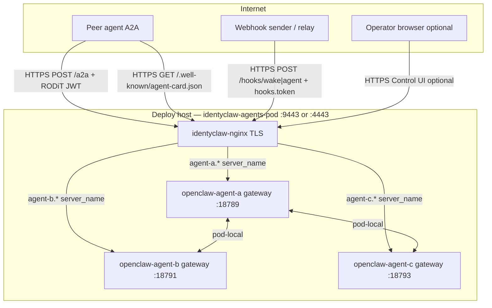
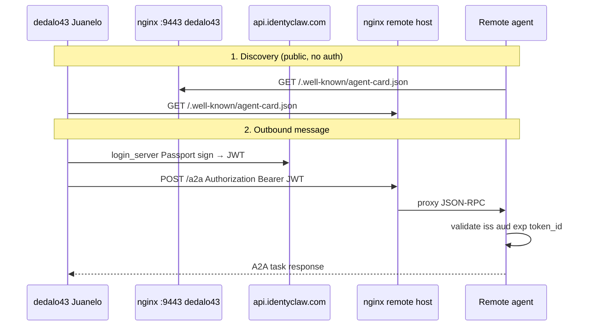
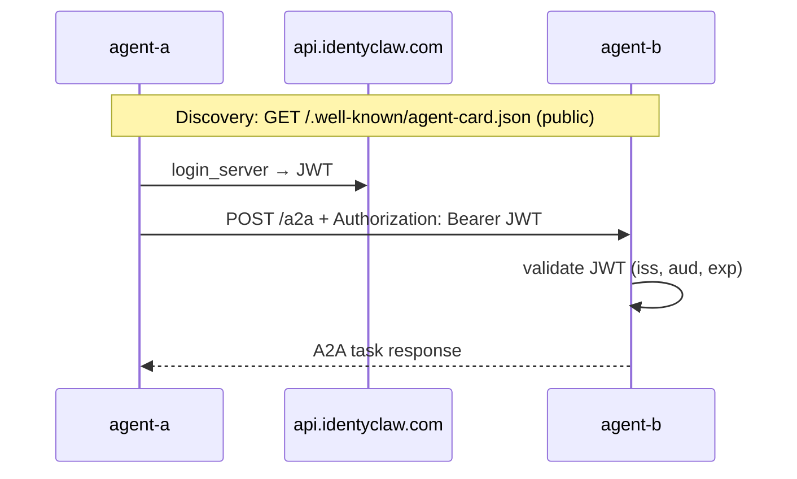

# Security & compliance improvements

Planned and recommended hardening for the identyclaw multi-agent stack (OpenClaw gateways in Podman).

| Section | Status |
|---------|--------|
| [Runtime layout](#runtime-layout-repository-vs-app-directory) | **Implemented** — config and secrets live only under `~/identyclaw-agents-app` |
| [Production ingress](#production-ingress-cicd--nginx-tls-sidecar) | **In repo** — not yet live on a host |
| [Cross-machine A2A (Option A)](#cross-machine-a2a-option-a--implementation-plan) | **In progress** — ports **9443** (main) / **4443** (dev) in repo; host deploy pending certs/DNS |
| [A2A agent-to-agent](#a2a-agent-to-agent-communication-agent-a--agent-b) | Partially automated; RODiT plugin on bootstrap |

---

## Runtime layout (repository vs app directory)

### Summary

Runtime **configuration, TLS material, and secrets** live **outside the git checkout** under a single app root on the deploy host. The repository holds scripts, Containerfiles, and nginx config only — nothing sensitive is read from the clone at runtime.

| Location | Role |
|----------|------|
| `~/identyclaw-agents` | Git clone — run `./identyclaw.sh` and deploy scripts from here |
| `~/identyclaw-agents-app` | App root (`IDENTYCLAW_APP_DIR`) — all operator config and agent state |

Override the app root: `export IDENTYCLAW_APP_DIR=/custom/path` (CI and `deploy-pod.sh` set this from `APP_DIR`).

### Directory tree

```text
~/identyclaw-agents/                         # git — code only; never holds secrets
  identyclaw.sh
  env.example                                # template copied into app dir on init
  scripts/lib.sh                             # load_env(), agent_home(), ensure_app_layout()

~/identyclaw-agents-app/                     # IDENTYCLAW_APP_DIR (default)
  env.local                                  # runtime settings (chmod 600)
  certs/
    fullchain.pem                            # nginx TLS (production pod)
    privkey.pem
  logs/nginx/                                # nginx access/error logs (pod mode)
  secrets/                                   # reserved app-level slot (mode 750)
  agents/                                    # IDENTYCLAW_AGENT_STATE_ROOT (default)
    agent-a/
      openclaw.json                          # gateway + plugins + hooks
      .env                                   # OPENCLAW_GATEWAY_TOKEN, IDENTYCLAW_*
      workspace/                             # skills, IDENTYCLAW.md
      secrets/                               # imap.pass, near-credentials/, tokens (mode 700)
    agent-b/                                 # same structure
    agent-c/
  exports/                                   # export-agent archives (identyclaw-migrate-*.tar.gz)
```

`./identyclaw.sh init` and `scripts/deploy-pod.sh` call `ensure_app_layout()` to create `certs/`, `logs/nginx/`, `secrets/`, `agents/`, and `exports/`, and seed `env.local` from `env.example` when missing.

### What lives where

| Path | Contents | In git? | CI / deploy touches? |
|------|----------|---------|----------------------|
| `~/identyclaw-agents` | Scripts, images, nginx configs | Yes | Clone + run deploy scripts only |
| `~/identyclaw-agents-app/env.local` | Ports, deploy mode, public hosts, optional mailbox passwords | No | Never |
| `~/identyclaw-agents-app/certs/` | TLS PEMs for nginx sidecar | No | Never (operator installs) |
| `~/identyclaw-agents-app/agents/<id>/` | Per-agent `openclaw.json`, `.env`, `secrets/`, workspace | No | Never |
| `~/identyclaw-agents-app/exports/` | Migration archives from `export-agent` | No | Never |

**Legacy paths are not used:** scripts no longer read `~/.openclaw-agent-*` or a repo-root `env.local`. Migrate any existing state into the app tree, then remove stale copies.

### How scripts resolve paths

| Function / command | Behaviour |
|--------------------|-----------|
| `load_env()` ([`scripts/lib.sh`](scripts/lib.sh)) | Reads **only** `$IDENTYCLAW_APP_DIR/env.local` |
| `agent_home <id>` | Returns `$IDENTYCLAW_AGENT_STATE_ROOT/<id>` (default `$IDENTYCLAW_APP_DIR/agents/<id>`) |
| `./identyclaw.sh <cmd>` | Sources `lib.sh`; no manual `export` required on a default layout |
| `scripts/deploy-pod.sh` | Requires `APP_DIR`; exports `IDENTYCLAW_APP_DIR` and calls `ensure_app_layout` |
| `scripts/deploy-local-podman.sh` | Defaults `APP_DIR=~/identyclaw-agents-app`; passes through to `deploy-pod.sh` |
| [`.github/workflows/deploy.yml`](.github/workflows/deploy.yml) | Sets `APP_DIR=/home/<deploy-user>/identyclaw-agents-app` on the SSH target |

### Container mount mapping

Each host agent directory is bind-mounted into its Podman container at OpenClaw’s expected path:

| Host | Container (`openclaw-agent-<id>`) |
|------|-----------------------------------|
| `~/identyclaw-agents-app/agents/agent-a/` | `/home/node/.openclaw` |

Bootstrap snippets that reference `/home/node/.openclaw/secrets/…` or `/home/node/.openclaw/workspace` are **container paths** backed by the host mount — not a second copy of state on the host.

### Environment variables

| Variable | Default | Purpose |
|----------|---------|---------|
| `IDENTYCLAW_APP_DIR` | `~/identyclaw-agents-app` | App root: `env.local`, `certs/`, `exports/` |
| `IDENTYCLAW_AGENT_STATE_ROOT` | `$IDENTYCLAW_APP_DIR/agents` | Parent of `agent-a`, `agent-b`, `agent-c` |
| `IDENTYCLAW_DEPLOY_MODE` | `standalone` (from `env.example`) | `standalone` = loopback gateways; `pod` = nginx TLS ingress |
| `IDENTYCLAW_INGRESS_PORT` | `9443` (main) / `4443` (dev) | Public HTTPS port when `DEPLOY_MODE=pod` |

Set production values in `~/identyclaw-agents-app/env.local` — see [`env.example`](env.example).

### Security boundaries

| Control | Detail |
|---------|--------|
| Git exclusion | [`.gitignore`](.gitignore) — `env.local`, `secrets/`, `*.pass`, accidental `.openclaw-agent-*/` under the checkout |
| CI scope | Workflow pushes images and runs deploy scripts; **no** secrets injected over SSH |
| Filesystem permissions | `env.local` mode `600`; `certs/` mode `711`; app `secrets/` mode `750`; per-agent `secrets/` mode `700` |
| Agent export/import | Archives under `exports/`; `env.local.fragment` merged into app `env.local` on import — never into the repo |
| Gitleaks | Scans the repository only; app dir is operator-managed on the host |

This matches the production trust model in [Trust boundaries (production)](#trust-boundaries-production): per-agent secrets stay under `agents/<id>/`, not a shared flat `secrets.env`.

### Migration from legacy layout

If upgrading from an earlier checkout-centric or `~/.openclaw-agent-*` layout:

1. **Agent state** — copy each legacy dir into the app tree:
   ```bash
   mkdir -p ~/identyclaw-agents-app/agents
   cp -a ~/.openclaw-agent-a ~/identyclaw-agents-app/agents/agent-a   # if present
   ```
2. **Config** — merge any repo-root `env.local` into `~/identyclaw-agents-app/env.local`, or run `./identyclaw.sh init` and re-apply settings.
3. **Verify** — `./identyclaw.sh status` and `./identyclaw.sh token agent-a` should resolve paths without extra `export`.
4. **Cleanup** — remove stale `~/identyclaw-agents/env.local` and `~/.openclaw-agent-*` after confirming the app dir works.

**dedalo43 (Juanelo):** state migrated to `~/identyclaw-agents-app/agents/agent-a`; pod deploy uses `~/identyclaw-agents-app/env.local` with `IDENTYCLAW_DEPLOY_MODE=pod`.

### Operator quick reference

```bash
cd ~/identyclaw-agents
./identyclaw.sh init                    # creates ~/identyclaw-agents-app/ + env.local
# edit ~/identyclaw-agents-app/env.local (standalone or pod)

./identyclaw.sh set-password agent-a
./identyclaw.sh start all               # standalone
# or production pod:
AGENT_IDS=agent-a TARGET=main ./scripts/deploy-local-podman.sh
```

See also [README — Repository vs app directory](README.md#repository-vs-app-directory).

---

## Production ingress (CI/CD + nginx TLS sidecar)

### Summary

Expose each OpenClaw gateway on the public internet over **HTTPS** for **agent-to-agent (A2A)** messaging and **OpenClaw webhook** delivery — the same operational pattern as [`clienttest-idc`](../clienttest-idc) (TLS nginx sidecar → app HTTP), but with **one subdomain per agent** instead of a single `webhook.*` host.

Images build in GitHub Actions, publish to GHCR, and deploy to a rootless Podman host with an **nginx TLS sidecar** in front of the gateways ([`cicd-deployment-standard.md`](../docs/docs/cicd-deployment-standard.md)).

The nginx sidecar **complements** the OpenClaw gateway — it terminates TLS and reverse-proxies HTTP/WebSocket traffic. It does **not** replace gateway auth (`hooks.token` for webhooks, RODiT JWT for A2A, gateway token for Control UI).

**Comparison with [`clienttest-idc`](../clienttest-idc):**

| | clienttest-idc | identyclaw-agents |
|--|----------------|-------------------|
| Purpose | RODiT webhook test API | A2A + OpenClaw webhooks per agent |
| Host | `webhook.discernible.io:7443` (one service) | `agent-{a,b,c}.*:9443` (main) or `:4443` (dev) |
| Webhook paths | `/webhook`, `/hooks/wake`, `/hooks/agent` | OpenClaw `/hooks/wake`, `/hooks/agent`, `/hooks/<name>` |
| Webhook auth | RODiT Ed25519 (`x-signature`) | OpenClaw `hooks.token` (`Authorization: Bearer`) |
| A2A | N/A | `POST /a2a` + `GET /.well-known/agent-card.json` |
| nginx routing | Catch-all `location /` → Node :8080 | Catch-all `location /` → gateway upstream per `server_name` |

### Current state (implemented in this repo)

| Layer | Status | Location |
|-------|--------|----------|
| App-dir runtime layout (config/secrets outside git) | Done | [`scripts/lib.sh`](scripts/lib.sh), [Runtime layout](#runtime-layout-repository-vs-app-directory) |
| CI workflow (Gitleaks + GHCR build/push + SSH deploy) | Done | [`.github/workflows/deploy.yml`](.github/workflows/deploy.yml) |
| OpenClaw runtime image (Himalaya, Chromium, Discord seed) | Done | [`Containerfile.himalaya`](Containerfile.himalaya) |
| nginx TLS sidecar image | Done | [`nginx.Dockerfile`](nginx.Dockerfile), [`nginx/nginx.main.conf`](nginx/nginx.main.conf), [`nginx/nginx.development.conf`](nginx/nginx.development.conf) |
| Pod deploy script (3 agents + nginx in one pod) | Done | [`scripts/deploy-pod.sh`](scripts/deploy-pod.sh) |
| Local deploy mirror of CI | Done | [`scripts/deploy-local-podman.sh`](scripts/deploy-local-podman.sh) |
| Rootless linger helper | Done | [`scripts/ensure-podman-linger.sh`](scripts/ensure-podman-linger.sh) |
| Pod-mode gateway ports + Control UI origins | Done | [`scripts/lib.sh`](scripts/lib.sh) — `ensure_production_ingress_config`, `agent_internal_gateway_port` |
| A2A public base URL fallback in pod mode | Done | [`scripts/lib.sh`](scripts/lib.sh) — `agent_a2a_public_base_url` → `https://<host>:9443` (main) or `:4443` (dev) |
| Gitleaks config | Done | [`.gitleaks.toml`](.gitleaks.toml) |
| Operator docs | Done | [README — Production ingress](README.md#production-ingress-cicd--nginx-tls) |

**Not live yet:** no host has been bootstrapped, no TLS material installed, no GitHub deploy secrets configured, and no successful CI deploy has run.

### Deployment modes

| Mode | Command / trigger | Ingress | Agent state dir |
|------|-------------------|---------|-----------------|
| **Standalone dev** | `./identyclaw.sh start` | `127.0.0.1:18789/18791/18793` (SSH tunnel) | `~/identyclaw-agents-app/agents/agent-{a,b,c}` |
| **Production pod** (target) | CI push or `./scripts/deploy-local-podman.sh` | `https://agent-{a,b,c}.<host>:9443` (main) or `:4443` (dev) via nginx | `~/identyclaw-agents-app/agents/agent-{a,b,c}` |

Both modes use the same [runtime layout](#runtime-layout-repository-vs-app-directory). Set `IDENTYCLAW_DEPLOY_MODE=pod` (and `IDENTYCLAW_INGRESS_PORT`, `AGENT_*_PUBLIC_HOST`) in `~/identyclaw-agents-app/env.local` for production ingress (see [`env.example`](env.example)).

### Architecture



**Pod network:** all four containers share one network namespace. Each gateway binds a **distinct** pod-local port (18789 / 18791 / 18793). nginx proxies by `server_name` to `127.0.0.1:<port>`.

**Branch → hostnames** (must match nginx `server_name`, workflow `DOMAIN`, and certificate SAN):

| Branch | Health-check host (`DOMAIN`) | All agent hosts |
|--------|------------------------------|-----------------|
| `development` | `agent-a.dihola.io` | `agent-b.dihola.io`, `agent-c.dihola.io` |
| `main` | `agent-a.identyclaw.com` | `agent-b.identyclaw.com`, `agent-c.identyclaw.com` |

External port (planned):

| Branch / tier | `APP_PORT` / `IDENTYCLAW_INGRESS_PORT` | Example base URL |
|---------------|----------------------------------------|------------------|
| `main` | **9443** | `https://agent-a.identyclaw.com:9443` |
| `development` | **4443** | `https://agent-a.dihola.io:4443` |

> **Note:** Repo uses **9443** (main) and **4443** (development). Set `IDENTYCLAW_INGRESS_PORT` in `~/identyclaw-agents-app/env.local` to match the deployed tier.

### Public URLs (production pod)

Each agent gets its own hostname. Route external senders to the **correct subdomain** — webhooks and A2A are not interchangeable across agents.

**Main (`agent-*.identyclaw.com`):**

| Agent | Webhook base | Standard paths | A2A |
|-------|--------------|----------------|-----|
| agent-a | `https://agent-a.identyclaw.com:9443` | `POST …/hooks/wake`, `POST …/hooks/agent`, `POST …/hooks/<name>` | `POST …/a2a`, `GET …/.well-known/agent-card.json` |
| agent-b | `https://agent-b.identyclaw.com:9443` | same | same |
| agent-c | `https://agent-c.identyclaw.com:9443` | same | same |

**Development (`agent-*.dihola.io`, port **4443**):** same table with `dihola.io` hosts and `:4443`.

**Webhook auth (OpenClaw):** `Authorization: Bearer <hooks.token>` or `x-openclaw-token: <hooks.token>`. Query-string tokens are rejected. Configure in each agent’s `openclaw.json` (`hooks.enabled`, `hooks.token`) — separate from `OPENCLAW_GATEWAY_TOKEN`. See [OpenClaw webhook docs](https://github.com/openclaw/openclaw/blob/main/docs/automation/webhook.md).

**RODiT / Passport metadata:** register the agent’s webhook base (e.g. `https://agent-a.identyclaw.com:9443`) in token metadata `webhook_url`, same field pattern as [`clienttest-idc`](../clienttest-idc) (`https://webhook.discernible.io:7443`). Outbound peers append the path (`/hooks/wake`, `/hooks/agent`, etc.) when sending.

**CLI helpers:**

```bash
# Paths resolve from ~/identyclaw-agents-app/env.local — no export needed on default layout
./identyclaw.sh webhook-url agent-a              # …/hooks/wake
./identyclaw.sh webhook-url agent-a hooks/agent
./identyclaw.sh status                           # all ingress URLs in pod mode
./identyclaw.sh test-webhook agent-a             # expect HTTP 401 without token
./identyclaw.sh test-a2a agent-a agent-b
```

### Trust boundaries (production)

| Surface | Protection | Notes |
|---------|------------|-------|
| Control UI (`/`) | `OPENCLAW_GATEWAY_TOKEN` | Token required; do not expose token in URLs on untrusted clients |
| `POST /a2a` | RODiT Passport JWT | See [A2A section](#a2a-agent-to-agent-communication-agent-a--agent-b) |
| `GET /.well-known/agent-card.json` | Public by design | A2A discovery; no secrets in Agent Card |
| Webhooks (`/hooks/...`) | Per-agent `hooks.token` | Route to correct subdomain per agent |
| nginx | TLS 1.2/1.3, security headers, HSTS (main), rate limiting | Shared includes in `nginx/inc/` |
| Host filesystem | `~/identyclaw-agents-app/agents/*/secrets/` mode `700` | Never in git; not copied by CI |

**Deviation from generic CI/CD standard:** runtime secrets live under **`~/identyclaw-agents-app`** in per-agent `agents/<id>/.env` and `secrets/` (gateway tokens, OpenRouter keys, NEAR credentials), not a single `secrets/secrets.env` and not in the git checkout. CI injects nothing over SSH except images and deploy scripts. See [Runtime layout](#runtime-layout-repository-vs-app-directory).

### Alignment with `cicd-deployment-standard.md`

| Standard requirement | identyclaw-agents |
|---------------------|-------------------|
| GHCR images built in CI | `openclaw-himalaya` + `identyclaw-nginx` (tags: `<sha>-main` / `<sha>-development`) |
| Host `APP_DIR` layout (`certs/`, `logs/`, `secrets/`) | `~/identyclaw-agents-app/` |
| `podman unshare chown 101:101` on TLS PEMs | In `deploy-pod.sh` |
| `ensure-podman-linger.sh` on deploy | In workflow |
| Gitleaks gate before build | In workflow |
| Advisory HTTPS health check | `GET https://<DOMAIN>:9443/health` (main) or `:4443/health` (dev) → `healthy` |
| `enforce-minimum-package-age.js` | **N/A** — no root `package.json`; OpenClaw image pins base tag |

### Next steps (operator / infra)

Ordered checklist to go from **in-repo** to **live production**:

#### 1. DNS

- [ ] Create **A records** for all three agent hostnames on each environment’s deploy host.
- [ ] Align names with nginx `server_name` and certificate SAN (change all three together if renaming).

#### 2. TLS certificates

- [ ] Issue certs covering `agent-a`, `agent-b`, and `agent-c` hostnames (multi-SAN or wildcard).
- [ ] Install `fullchain.pem` and `privkey.pem` under `~/identyclaw-agents-app/certs/`.
- [ ] On hosts using the [`infra`](../../infra) repo: add `identyclaw-agents-app` to `install-certs-to-apps.sh` / `verify-certs-in-apps.sh` (not done yet).
- [ ] Verify after install: `podman unshare chown 101:101` + key mode `600` (deploy script applies this each run).

#### 3. Host bootstrap

See [Runtime layout](#runtime-layout-repository-vs-app-directory) for the full tree. Minimum on the deploy host:

- [ ] `./identyclaw.sh init` from the git clone (creates `~/identyclaw-agents-app/` and seeds `env.local`), **or** manually:
  ```bash
  mkdir -p ~/identyclaw-agents-app/{certs,logs/nginx,secrets,agents,exports}
  cp ~/identyclaw-agents/env.example ~/identyclaw-agents-app/env.local
  chmod 600 ~/identyclaw-agents-app/env.local
  ```
- [ ] Edit `~/identyclaw-agents-app/env.local`: set `IDENTYCLAW_DEPLOY_MODE=pod`, `IDENTYCLAW_INGRESS_PORT`, and `AGENT_*_PUBLIC_HOST` for the branch.
- [ ] Initialize agent state under `agents/` (never `~/.openclaw-agent-*`):

  ```bash
  ./identyclaw.sh set-password agent-a   # repeat b, c
  ./identyclaw.sh set-api-key agent-a
  ```

- [ ] Migrate legacy state from `~/.openclaw-agent-*` if needed (see [Migration from legacy layout](#migration-from-legacy-layout)).

#### 4. GitHub Actions secrets

- [ ] Configure in `discernible-io/identyclaw-agents` → Settings → Secrets: `SSH_HOST_MAIN`, `SSH_USER_MAIN`, `SSH_PRIVATE_KEY_MAIN`, `SSH_KNOWN_HOSTS_MAIN`, `SSH_*_DEVELOPMENT`, `GHCR_PULL_TOKEN`.
- [ ] Create `development` branch if deploying to a dev host (workflow triggers on `main` and `development`; only `main` exists today).

#### 5. Host firewall and infra

- [ ] Allow TCP **9443** (main) and/or **4443** (dev) on the deploy host (alongside existing service ports in [`infra/docs/production-hosts.md`](../../infra/docs/production-hosts.md)). No A2A-specific iptables rules — open the ingress port only.
- [ ] Enable logind **linger** for the deploy user (workflow runs `ensure-podman-linger.sh`; verify `Linger=yes`).

#### 6. First deploy and verification

- [ ] Push to target branch (or run `./scripts/deploy-local-podman.sh` on the host).
- [ ] Confirm pod: `podman ps --filter pod=identyclaw-agents-pod`
- [ ] Health: `curl -sk https://agent-a.<host>:9443/health` (or `:4443` on dev) → `healthy`
- [ ] Webhooks: `./identyclaw.sh test-webhook agent-a` → HTTP 401 without `hooks.token` (enable `hooks` in `openclaw.json` first)
- [ ] A2A: `./identyclaw.sh test-a2a agent-a agent-b` with public URLs set (see [A2A verify](#4-verify))
- [ ] Control UI (optional): `https://agent-a.<host>:9443/#token=<token>` from `./identyclaw.sh token agent-a`

#### 7. Hardening (follow-up, not blocking first deploy)

- [x] Add nginx **rate limiting** on public paths (pattern: [`signsanctum-idc` nginx configs](../../signsanctum-idc/nginx/)).
- [x] Pin nginx base image by **digest** in `nginx.Dockerfile` (supply-chain parity with hardened services).
- [x] Document webhook URLs per agent subdomain for external integrators.
- [ ] Decide whether to keep **standalone** `identyclaw.sh start` on the same host or production-only pod (avoid duplicate gateways on the same ports).

### Related files

| File | Role |
|------|------|
| [`.github/workflows/deploy.yml`](.github/workflows/deploy.yml) | CI/CD |
| [`scripts/deploy-pod.sh`](scripts/deploy-pod.sh) | Host pod recreate |
| [`nginx/inc/openclaw-proxy.inc`](nginx/inc/openclaw-proxy.inc) | WebSocket-friendly proxy (3600s read timeout) |
| [`nginx/inc/http-common.inc`](nginx/inc/http-common.inc) | TLS, rate limits, client body limits |
| [`env.example`](env.example) | Template for `~/identyclaw-agents-app/env.local` |
| [`scripts/lib.sh`](scripts/lib.sh) | `identyclaw_app_dir`, `load_env`, `agent_home`, `ensure_app_layout` |
| [`identyclaw.sh`](identyclaw.sh) | Operator CLI; all commands use app dir paths |

---

## Cross-machine A2A (Option A) — implementation plan

**Goal:** Agent **Juanelo** on host **dedalo43** (standalone today) communicates via A2A with an agent on a **different machine**, using production ingress (nginx TLS sidecar) — not Tailscale Funnel or SSH tunnels.

**Status:** Repo port migration complete (**9443** / **4443**). Host deploy (DNS, TLS, firewall, pod) proceeds per checklist below.

### Why Option A

| Requirement | Option A (this plan) |
|-------------|----------------------|
| Remote peer reachability | Public DNS → host IP → nginx TLS → gateway |
| RODiT JWT `audience` | Must equal the URL peers use (HTTPS + host + port) |
| Discovery | `GET https://<host>:<port>/.well-known/agent-card.json` (public) |
| Messaging | `POST https://<host>:<port>/a2a` + `Authorization: Bearer <Passport JWT>` |
| Firewall | Open **one** TCP port per environment tier (9443 or 4443) |

**Not required:** custom iptables chains, Passport changes at `api.identyclaw.com`, or static A2A API keys.

### Port allocation (agreed)

| Tier | Branch | Ingress port | Example Agent Card URL |
|------|--------|--------------|------------------------|
| Production | `main` | **9443** | `https://agent-a.identyclaw.com:9443/.well-known/agent-card.json` |
| Development | `development` | **4443** | `https://agent-a.dihola.io:4443/.well-known/agent-card.json` |

Single-agent hosts (e.g. dedalo43 with only **agent-a**) use the same pattern: one hostname, one nginx listener, one gateway upstream.

### Current gap on dedalo43 (Juanelo)

| Item | Today | Target |
|------|-------|--------|
| Deploy mode | Standalone (`PUBLISH_HOST=127.0.0.1`) | `IDENTYCLAW_DEPLOY_MODE=pod` |
| Ingress | Loopback only | nginx TLS on **9443** or **4443** |
| `inbound.auth.audience` | `http://openclaw-agent-a:18789` | `https://<public-host>:<port>` |
| `inbound.publicBaseUrl` | unset | same as audience base |
| Outbound peers | none | remote Agent Card URL in `outbound.agents` |
| DNS / TLS / firewall | not configured | see checklist below |

### End-to-end flow (two machines)



### Information to exchange with the remote operator

Each side publishes exactly these values to the other (no secrets in Agent Card):

| Field | Local (Juanelo / dedalo43) | Remote (peer) |
|-------|---------------------------|---------------|
| **Agent display name** | Juanelo | _(peer fills in)_ |
| **Public base URL** | `https://agent-a.<host>:9443` | `https://<peer-host>:<peer-port>` |
| **Agent Card URL** | `{base}/.well-known/agent-card.json` | `{peer-base}/.well-known/agent-card.json` |
| **A2A endpoint** | `{base}/a2a` | `{peer-base}/a2a` |
| **Passport `token_id`** | 12-letter ID (for impersonation guard) | peer’s `token_id` |
| **RODiT issuer** | `https://api.identyclaw.com` (both sides) | same |

**JWT rule:** On each host, `plugins.entries.a2a.config.inbound.auth.audience` and `inbound.publicBaseUrl` must match the **public base URL** the other machine uses when calling `POST /a2a`. Mismatch → all inbound JWT validation fails.

### Implementation checklist (execute on operator command)

#### Phase 0 — Repo / config (one PR or local edit batch)

- [x] Set `APP_PORT` / `IDENTYCLAW_INGRESS_PORT`: **9443** (`main`), **4443** (`development`) in:
  - [`.github/workflows/deploy.yml`](.github/workflows/deploy.yml)
  - [`nginx/nginx.main.conf`](nginx/nginx.main.conf) (`listen 9443 ssl`)
  - [`nginx/nginx.development.conf`](nginx/nginx.development.conf) (`listen 4443 ssl`)
  - [`nginx.Dockerfile`](nginx.Dockerfile) `EXPOSE`
  - [`scripts/deploy-pod.sh`](scripts/deploy-pod.sh), [`scripts/deploy-local-podman.sh`](scripts/deploy-local-podman.sh)
  - [`env.example`](env.example) default + comments
- [x] Update [`README.md`](README.md) URL tables to 9443 / 4443.

#### Phase 1 — DNS (both machines if both are public)

- [ ] **A record** for Juanelo host → e.g. `agent-a.identyclaw.com` (main) or `agent-a.dihola.io` (dev) → dedalo43 public IP.
- [ ] Remote operator: A record for their agent hostname → their host IP.
- [ ] Confirm from outside: `dig +short agent-a.<host>` returns the expected IP.

#### Phase 2 — TLS certificates

- [ ] Issue cert(s) with SAN covering the agent hostname(s).
- [ ] Install on dedalo43:
  - `~/identyclaw-agents-app/certs/fullchain.pem`
  - `~/identyclaw-agents-app/certs/privkey.pem`
- [ ] Remote operator installs certs on their ingress path (same layout or equivalent reverse proxy).
- [ ] Permissions: `podman unshare chown 101:101` on PEMs; key mode `600`.

#### Phase 3 — Host firewall

- [ ] **dedalo43:** allow inbound TCP **9443** (main) or **4443** (dev) — e.g. `firewall-cmd` or cloud security group.
- [ ] Remote host: open their ingress port.
- [ ] No outbound rule changes for A2A (agents initiate HTTPS to peers).

#### Phase 4 — Bootstrap dedalo43 (Juanelo)

- [x] Stop standalone container if it conflicts with pod ports:
  ```bash
  ./identyclaw.sh stop agent-a
  ```
- [x] Create [app layout](#runtime-layout-repository-vs-app-directory) under `~/identyclaw-agents-app/` (`env.local`, `certs/`, `agents/`).
- [x] Set in `~/identyclaw-agents-app/env.local`:
  ```bash
  IDENTYCLAW_DEPLOY_MODE=pod
  IDENTYCLAW_INGRESS_PORT=9443          # or 4443 on development
  AGENT_A_PUBLIC_HOST=agent-a.identyclaw.com
  AGENT_A_A2A_PUBLIC_BASE_URL=https://agent-a.identyclaw.com:9443
  ```
- [x] Migrate state: `~/.openclaw-agent-a` → `~/identyclaw-agents-app/agents/agent-a` (preserve `secrets/near-credentials/`).
- [x] Deploy pod (local):
  ```bash
  AGENT_IDS=agent-a TARGET=main ./scripts/deploy-local-podman.sh
  # or push to branch for CI deploy
  ```
- [x] Restart/bootstrap so `ensure_a2a_config` sets `publicBaseUrl` + `audience` to `https://agent-a.identyclaw.com:9443`.

#### Phase 5 — Wire outbound peer (both sides)

On **dedalo43**, add remote peer to `~/identyclaw-agents-app/agents/agent-a/openclaw.json`:

```json
"plugins": {
  "entries": {
    "a2a": {
      "config": {
        "outbound": {
          "agents": {
            "remote-peer": {
              "url": "https://<REMOTE_HOST>:<REMOTE_PORT>/.well-known/agent-card.json"
            }
          }
        }
      }
    }
  }
}
```

Remote operator adds the mirror entry pointing at Juanelo’s Agent Card URL. Restart gateways after editing (or rely on bootstrap if using a shared peer map).

Enable tools (if missing): `a2a_send_message`, `a2a_get_agents`, `a2a_get_task`, etc. — bootstrap adds these when A2A is enabled.

#### Phase 6 — Verify

**From any external network:**

```bash
# Discovery (public)
curl -sS https://agent-a.identyclaw.com:9443/.well-known/agent-card.json | jq .

# Inbound auth gate (must be 401)
curl -sS -o /dev/null -w '%{http_code}\n' -X POST \
  https://agent-a.identyclaw.com:9443/a2a \
  -H 'Content-Type: application/json' -d '{}'
```

**On dedalo43:**

```bash
./identyclaw.sh status
curl -sk https://agent-a.identyclaw.com:9443/health
./identyclaw.sh ask agent-a 'Use a2a_send_message to ping remote-peer and report the task id'
```

**Remote operator** runs the symmetric test toward Juanelo.

#### Phase 7 — Passport metadata (optional but recommended)

- [ ] Register `webhook_url` = `https://agent-a.identyclaw.com:9443` in IdentyClaw Passport token metadata (discovery for integrators; A2A peers use Agent Card URL directly).

### Shareable brief for the remote agent operator

Copy/paste for coordination:

---

**IdentyClaw A2A peer onboarding — Juanelo (dedalo43)**

1. **Protocol:** [A2A](https://a2a-protocol.org/) via [`openclaw-a2a-idc-plugin`](https://github.com/discernible-io/openclaw-a2a-idc-plugin) (RODiT / Passport JWT).
2. **Our public URLs (after deploy):**
   - Agent Card: `https://agent-a.identyclaw.com:9443/.well-known/agent-card.json`
   - A2A: `POST https://agent-a.identyclaw.com:9443/a2a`
   - Issuer: `https://api.identyclaw.com`
3. **We need from you:**
   - Your public Agent Card URL (`https://…/.well-known/agent-card.json`)
   - Your public base URL (for our `outbound.agents` config)
   - Your Passport `token_id` (12 letters) for identity verification
4. **You need from us:** the three values in §2 plus our `token_id`.
5. **On your host:** set `inbound.publicBaseUrl` and `inbound.auth.audience` to your public base URL; open your ingress port; add our Agent Card under `outbound.agents`.
6. **Auth:** Bearer JWT from IdentyClaw login — no static A2A API keys. Agent Card is public; `POST /a2a` is not.
7. **Verify:** unauthenticated `POST /a2a` → HTTP 401; then `a2a_send_message` from either side.

---

### Related files (will change on implement)

| File | Change |
|------|--------|
| [`.github/workflows/deploy.yml`](.github/workflows/deploy.yml) | `APP_PORT` 9443 / 4443 per branch |
| [`nginx/nginx.main.conf`](nginx/nginx.main.conf) | `listen 9443 ssl` |
| [`nginx/nginx.development.conf`](nginx/nginx.development.conf) | `listen 4443 ssl` |
| [`env.example`](env.example) | `IDENTYCLAW_INGRESS_PORT` defaults |
| [`scripts/lib.sh`](scripts/lib.sh) | default `IDENTYCLAW_INGRESS_PORT` |
| [`scripts/deploy-pod.sh`](scripts/deploy-pod.sh) | pod publish port |

---

## A2A agent-to-agent communication (agent-a ↔ agent-b)

### Summary

Replace ad-hoc cross-agent coordination (Discord @mentions, email) with the [Agent-to-Agent (A2A) protocol](https://a2a-protocol.org/) via the IdentyClaw fork [`discernible-io/openclaw-a2a-idc-plugin`](https://github.com/discernible-io/openclaw-a2a-idc-plugin) (RODiT / Passport JWT auth). See the fork work plan in that repo’s `a2afork.md`.

Each agent exposes a small, purpose-built HTTP surface for peer messaging instead of sharing a Discord channel or mailbox. That improves **authentication**, **auditability**, and **least privilege** compared to today’s channels.

### Current state

| Channel | How agent-a and agent-b talk today | Security gap |
|--------|-------------------------------------|--------------|
| Discord | Shared guild; `allowBots: "mentions"` lets bots @mention each other | Broad channel access; bot tokens; mention-based triggering with no per-peer credential |
| Email (Himalaya) | Migadu mailboxes; any message to the address is accepted | Mailbox is a shared ingress; IMAP/SMTP credentials in agent secrets |
| `sessions_send` | Listed in `tools.allow` | Same-gateway sessions only — **not** cross-container |

**Runtime paths:** all agents use [Runtime layout](#runtime-layout-repository-vs-app-directory) — `~/identyclaw-agents-app/agents/<id>/`.

**Standalone dev:** gateways bind on `127.0.0.1` (`PUBLISH_HOST` in `~/identyclaw-agents-app/env.local`).

**Production ingress:** see [Production ingress](#production-ingress-cicd--nginx-tls-sidecar). In pod mode, peer discovery can use pod-local URLs (`http://127.0.0.1:18791`, etc.) or public HTTPS URLs when `AGENT_*_A2A_PUBLIC_BASE_URL` / `AGENT_*_PUBLIC_HOST` are set in app `env.local`.

**Standalone multi-container:** peer traffic uses Podman network `identyclaw-net` and container DNS (`http://openclaw-agent-b:18789`, etc.) — see `ensure_identyclaw_network` in `scripts/lib.sh`.

### Target architecture

Both agents run the A2A plugin and configure:

1. **Inbound** — accept `POST /a2a` only with valid IdentyClaw/RODiT Passport JWTs.
2. **Outbound** — obtain short-lived JWT via `login_server` (NEAR credentials in `secrets/near-credentials/`).
3. **Networking** — shared Podman network (`identyclaw-net`) so peers resolve by container name (e.g. `http://openclaw-agent-b:18789`), not host loopback.



### Why RODiT JWT auth (not static API keys)

Agent Cards at `/.well-known/agent-card.json` are **intentionally public** — that is how A2A discovery works. Message delivery at `POST /a2a` must **not** be equally open.

The fork authenticates inbound requests with **short-lived Passport JWTs** via `@rodit/rodit-auth-be`:

| Property | Detail |
|----------|--------|
| Header | `Authorization: Bearer <jwt>` |
| Verification | `validate_jwt_token_be` — signature, `iss`, `aud`, `exp` |
| Config | `plugins.entries.a2a.config.inbound.auth` (`provider: rodit`) |
| Sender identity | JWT claim `token_id` (configurable via `identityClaim`) |

**Outbound:** each agent logs in with its own NEAR Passport credentials (`IDENTYCLAW_*` env vars synced from `secrets/near-credentials/*.json`). No pairwise static A2A keys.

Bootstrap never sets `allowUnauthenticated: true`.

### Trust boundaries (do not conflate)

| Credential | Purpose | Scope |
|------------|---------|--------|
| `OPENCLAW_GATEWAY_TOKEN` | Control UI / gateway admin | Human operator |
| A2A inbound RODiT JWT | Who may call `POST /a2a` | Peer agents with valid Passport |
| A2A outbound JWT | Credential presented **to** the peer | Obtained via `login_server` per call |
| `IDENTYCLAW_*` / NEAR key | Outbound JWT acquisition | Per-agent Passport |
| OpenRouter API key | Model provider | LLM calls only |
| Discord bot token | Discord channel | Discord ingress |
| Migadu password | IMAP/SMTP | Email ingress |

Rotating or revoking one must not require rotating unrelated secrets. Revoke a peer’s Passport session at the IdentyClaw API layer without touching gateway or Discord credentials.

### Compliance benefits

- **Least privilege:** Peers authenticate with Passport JWTs, not shared Discord/email credentials.
- **Explicit allowlist:** Outbound `agents` map names only known peers (no arbitrary URL delegation).
- **Sender attribution:** Inbound `token_id` ties each conversation thread to a verified Passport identity.
- **Revocation:** Expired or revoked JWTs are rejected; no long-lived static A2A keys in config.
- **Separation of discovery and action:** Public Agent Card vs authenticated `/a2a` matches a standard “directory vs API” pattern.
- **Audit surface:** A2A task storage under `a2a/inbound/` and `a2a/outbound/` (plugin default) supports later log/export policies.

### Implementation checklist

Automated by `./identyclaw.sh start` when `secrets/near-credentials/*.json` exists (see `ensure_a2a_config` in `scripts/lib.sh`).

#### 1. Prerequisites (each agent in `A2A_PEER_AGENTS`)

- NEAR Passport credentials in `~/identyclaw-agents-app/agents/<id>/secrets/near-credentials/*.json`
- `./identyclaw.sh restart agent-a agent-b` to apply bootstrap

#### 2. Peer Agent Card URLs (container DNS)

| Agent | Peer Agent Card URL |
|-------|---------------------|
| agent-a | `http://openclaw-agent-b:18789/.well-known/agent-card.json` |
| agent-b | `http://openclaw-agent-a:18789/.well-known/agent-card.json` |

#### 3. Optional public exposure

Set per-agent `AGENT_*_A2A_PUBLIC_BASE_URL` in `~/identyclaw-agents-app/env.local`, or rely on pod-mode auto-fill from `AGENT_*_PUBLIC_HOST` + `IDENTYCLAW_INGRESS_PORT` (e.g. `https://agent-a.identyclaw.com:9443`). Bootstrap sets `inbound.publicBaseUrl` and JWT `audience` accordingly. For **cross-machine** peers, see [Cross-machine A2A (Option A)](#cross-machine-a2a-option-a--implementation-plan).

#### 4. Verify

```bash
./identyclaw.sh test-a2a agent-a agent-b
./identyclaw.sh ask agent-a 'Use a2a_send_message to ping agent-b and report the task id'
```

### Secrets handling

All secrets stay under the [app directory](#runtime-layout-repository-vs-app-directory) — never in the git clone:

- Never commit NEAR private keys, gateway tokens, or `.env` files.
- Passport credentials: `~/identyclaw-agents-app/agents/<id>/secrets/near-credentials/` (mode `700`); synced to `.env` as `IDENTYCLAW_*` on bootstrap.
- Mailbox passwords: `agents/<id>/secrets/imap.pass` (via `./identyclaw.sh set-password`).
- Gateway tokens: `agents/<id>/.env` — use `./identyclaw.sh token <id>`; do not paste into docs or chat.
- No static A2A API keys in `openclaw.json`.

### identyclaw automation (implemented)

| Change | Location |
|--------|----------|
| Shared Podman network | `scripts/lib.sh` `ensure_identyclaw_network`, `identyclaw.sh` `start_one` |
| ClawHub skill + plugin (HOLA, identity) | `scripts/lib.sh` `ensure_identyclaw_packages` — [clawhub.ai/identyclaw/identyclaw](https://clawhub.ai/identyclaw/identyclaw) |
| Agent workspace guide | `scripts/lib.sh` `write_agent_identyclaw_doc` → `workspace/IDENTYCLAW.md` |
| Bootstrap RODiT inbound/outbound + tools | `scripts/lib.sh` `ensure_a2a_config` |
| A2A plugin from GitHub | `scripts/lib.sh` `ensure_a2a_packages` — [openclaw-a2a-idc-plugin](https://github.com/discernible-io/openclaw-a2a-idc-plugin) |
| Env placeholders | `env.example` — `A2A_PEER_AGENTS`, `AGENT_*_A2A_PUBLIC_BASE_URL` |
| Smoke test command | `identyclaw.sh test-a2a agent-a agent-b` |
| Bake A2A plugin into image (optional) | `Containerfile.himalaya`, `OPENCLAW_BUNDLED_PLUGINS` |

### Related controls (unchanged)

Discord and email can remain as fallback channels. Tightening them (separate channels per agent, DM-only policies) is independent of A2A and not required for A2A rollout.

---

*Last updated: 2026-06-08*
