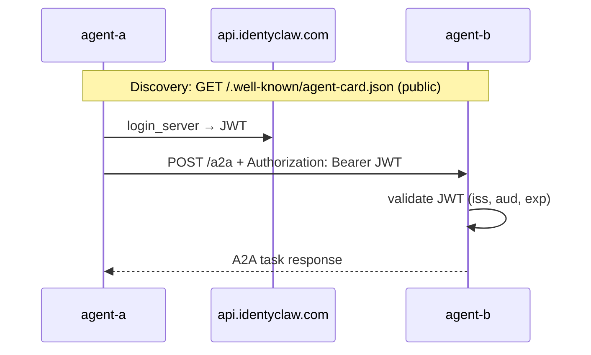

# Security & compliance improvements

Planned and recommended hardening for the identyclaw multi-agent stack (OpenClaw gateways in Podman).

---

## A2A agent-to-agent communication (agent-a ↔ agent-b)

### Summary

Replace ad-hoc cross-agent coordination (Discord @mentions, email) with the [Agent-to-Agent (A2A) protocol](https://a2a-protocol.org/) via the IdentyClaw fork [`discernible-io/openclaw-a2a-idc-plugin`](https://github.com/discernible-io/openclaw-a2a-idc-plugin) (RODiT / Passport JWT auth). See the fork work plan in that repo’s `a2afork.md`.

Each agent exposes a small, purpose-built HTTP surface for peer messaging instead of sharing a Discord channel or mailbox. That improves **authentication**, **auditability**, and **least privilege** compared to today’s channels.

### Current state

| Channel | How agent-a and agent-b talk today | Security gap |
|--------|-------------------------------------|--------------|
| Discord | Shared guild; `allowBots: "mentions"` lets bots @mention each other | Broad channel access; bot tokens; mention-based triggering with no per-peer credential |
| Email (Himalaya) | Migadu mailboxes; any message to the address is accepted | Mailbox is a shared ingress; IMAP/SMTP credentials in agent secrets |
| `sessions_send` | Listed in `tools.allow` | Same-gateway sessions only — **not** cross-container |

Gateways bind on the host at `127.0.0.1` (see `PUBLISH_HOST` in `env.local`). Peer traffic uses the shared Podman network `identyclaw-net` and container DNS (`openclaw-agent-a`, `openclaw-agent-b`).

### Target architecture

Both agents run the A2A plugin and configure:

1. **Inbound** — accept `POST /a2a` only with valid IdentyClaw/RODiT Passport JWTs.
2. **Outbound** — obtain short-lived JWT via `login_server` (NEAR credentials in `secrets/near-credentials/`).
3. **Networking** — shared Podman network (`identyclaw-net`) so peers resolve by container name (e.g. `http://openclaw-agent-b:18789`), not host loopback.



### Why RODiT JWT auth (not static API keys)

Agent Cards at `/.well-known/agent-card.json` are **intentionally public** — that is how A2A discovery works. Message delivery at `POST /a2a` must **not** be equally open.

The fork authenticates inbound requests with **short-lived Passport JWTs** via `@rodit/rodit-auth-be`:

| Property | Detail |
|----------|--------|
| Header | `Authorization: Bearer <jwt>` |
| Verification | `validate_jwt_token_be` — signature, `iss`, `aud`, `exp` |
| Config | `plugins.entries.a2a.config.inbound.auth` (`provider: rodit`) |
| Sender identity | JWT claim `token_id` (configurable via `identityClaim`) |

**Outbound:** each agent logs in with its own NEAR Passport credentials (`IDENTYCLAW_*` env vars synced from `secrets/near-credentials/*.json`). No pairwise static A2A keys.

Bootstrap never sets `allowUnauthenticated: true`.

### Trust boundaries (do not conflate)

| Credential | Purpose | Scope |
|------------|---------|--------|
| `OPENCLAW_GATEWAY_TOKEN` | Control UI / gateway admin | Human operator |
| A2A inbound RODiT JWT | Who may call `POST /a2a` | Peer agents with valid Passport |
| A2A outbound JWT | Credential presented **to** the peer | Obtained via `login_server` per call |
| `IDENTYCLAW_*` / NEAR key | Outbound JWT acquisition | Per-agent Passport |
| OpenRouter API key | Model provider | LLM calls only |
| Discord bot token | Discord channel | Discord ingress |
| Migadu password | IMAP/SMTP | Email ingress |

Rotating or revoking one must not require rotating unrelated secrets. Revoke a peer’s Passport session at the IdentyClaw API layer without touching gateway or Discord credentials.

### Compliance benefits

- **Least privilege:** Peers authenticate with Passport JWTs, not shared Discord/email credentials.
- **Explicit allowlist:** Outbound `agents` map names only known peers (no arbitrary URL delegation).
- **Sender attribution:** Inbound `token_id` ties each conversation thread to a verified Passport identity.
- **Revocation:** Expired or revoked JWTs are rejected; no long-lived static A2A keys in config.
- **Separation of discovery and action:** Public Agent Card vs authenticated `/a2a` matches a standard “directory vs API” pattern.
- **Audit surface:** A2A task storage under `a2a/inbound/` and `a2a/outbound/` (plugin default) supports later log/export policies.

### Implementation checklist

Automated by `./identyclaw.sh start` when `secrets/near-credentials/*.json` exists (see `ensure_a2a_config` in `scripts/lib.sh`).

#### 1. Prerequisites (each agent in `A2A_PEER_AGENTS`)

- NEAR Passport credentials in `~/.openclaw-<id>/secrets/near-credentials/*.json`
- `./identyclaw.sh restart agent-a agent-b` to apply bootstrap

#### 2. Peer Agent Card URLs (container DNS)

| Agent | Peer Agent Card URL |
|-------|---------------------|
| agent-a | `http://openclaw-agent-b:18789/.well-known/agent-card.json` |
| agent-b | `http://openclaw-agent-a:18789/.well-known/agent-card.json` |

#### 3. Optional public exposure

Set per-agent `AGENT_*_A2A_PUBLIC_BASE_URL` in `env.local` (e.g. `https://agent-a.diholai.io`) for reverse-proxy deployments. Bootstrap sets `inbound.publicBaseUrl` and JWT `audience` accordingly.

#### 4. Verify

```bash
./identyclaw.sh test-a2a agent-a agent-b
./identyclaw.sh ask agent-a 'Use a2a_send_message to ping agent-b and report the task id'
```

### Secrets handling

- Never commit NEAR private keys, gateway tokens, or `.env` files.
- Passport credentials live in `secrets/near-credentials/` (mode `700`); synced to `.env` as `IDENTYCLAW_*` on bootstrap.
- No static A2A API keys in `openclaw.json`.

### identyclaw automation (implemented)

| Change | Location |
|--------|----------|
| Shared Podman network | `scripts/lib.sh` `ensure_identyclaw_network`, `identyclaw.sh` `start_one` |
| Bootstrap RODiT inbound/outbound + tools | `scripts/lib.sh` `ensure_a2a_config` |
| Plugin install on start | `scripts/lib.sh` `ensure_a2a_packages` |
| Env placeholders | `env.example` — `A2A_PEER_AGENTS`, `AGENT_*_A2A_PUBLIC_BASE_URL` |
| Smoke test command | `identyclaw.sh test-a2a agent-a agent-b` |
| Bake A2A plugin into image (optional) | `Containerfile.himalaya`, `OPENCLAW_BUNDLED_PLUGINS` |

### Related controls (unchanged)

Discord and email can remain as fallback channels. Tightening them (separate channels per agent, DM-only policies) is independent of A2A and not required for A2A rollout.

---

*Last updated: 2026-06-06*
